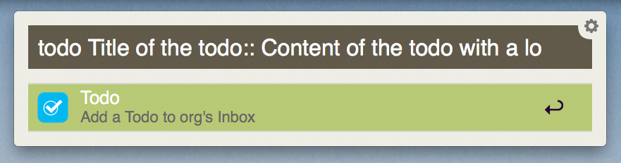
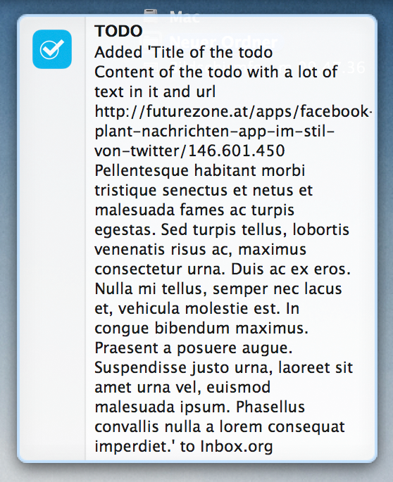
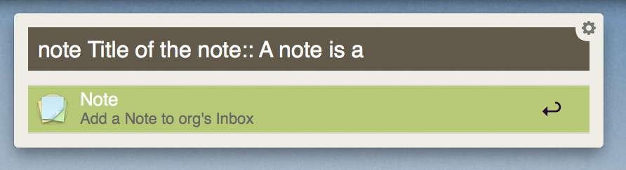
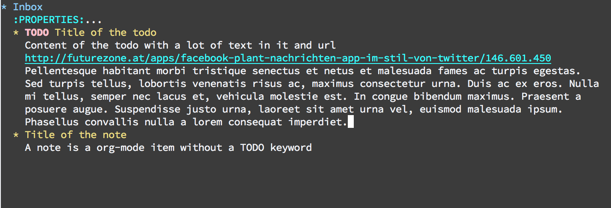
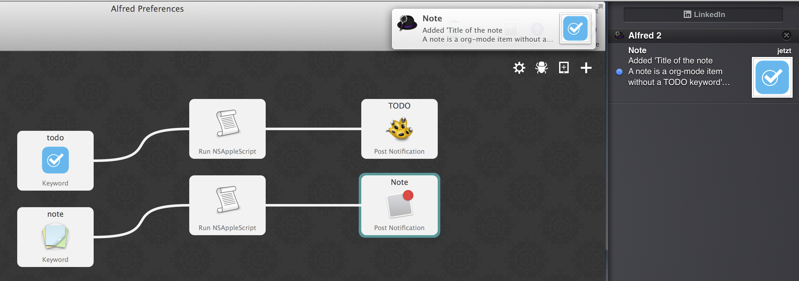

# An org-mode-capture workflow for Alfred
Add a todo or a note to an org-mode file with a short and convenient command in [Alfred](https://www.alfredapp.com/). The workflow requires Alfred's "Powerpack."

## Features
The command appends a second level heading to a user defined .org file and puts all what follows `::` into the body of the heading (see figures below).


Type todo to add a todo:






Type note to add a note:




The added notes are divided into title and content:




## Installation
Double klick on `org-mode-capture.alfredworkflow` to add it to Alfred's set of workflows. Then you need to edit the default path to your org-mode inbox file in both applescript nodes (absolute notation of the path is necessary):

```applescript
set inboxFile to "Inbox.org"
set inboxFilePath to "/Users/Alex/Documents/"
```

If you don't use growl, you can change the notification nodes in the alfred workflows to apple's notification centre:


