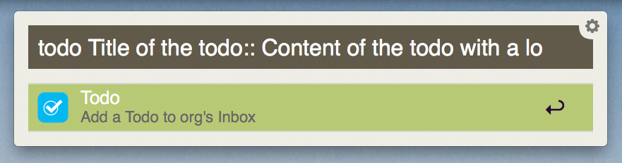
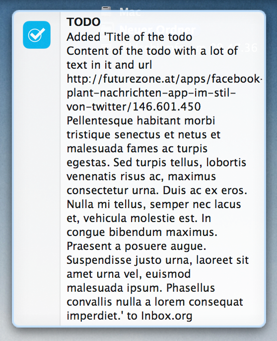
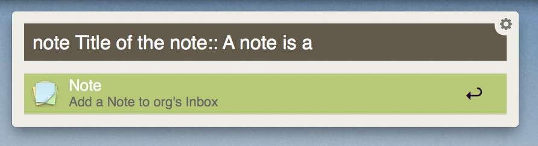
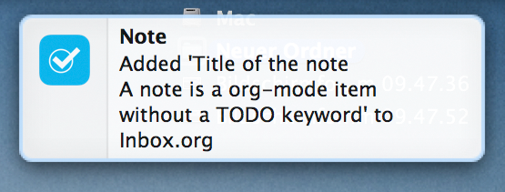
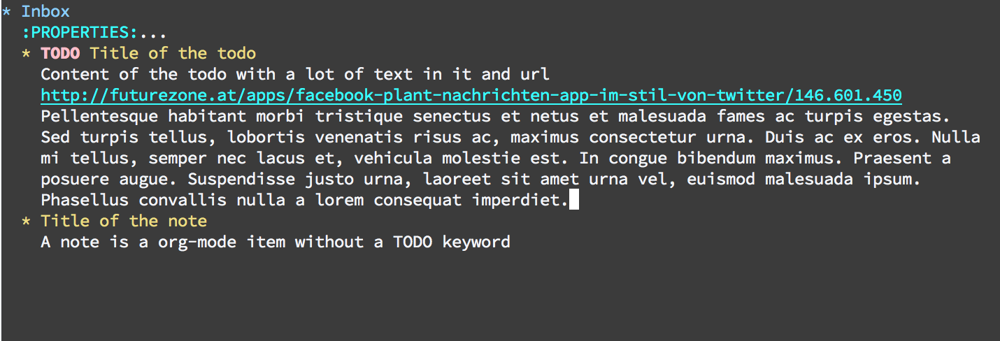
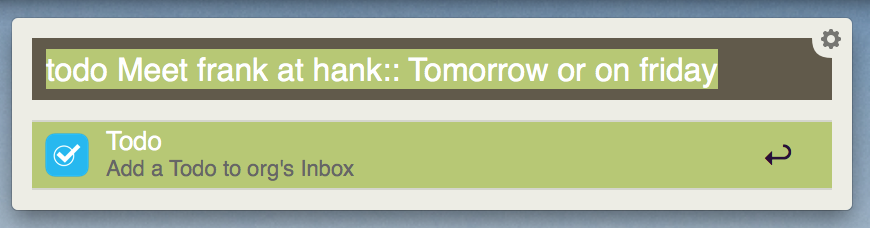
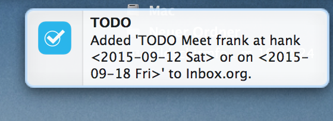
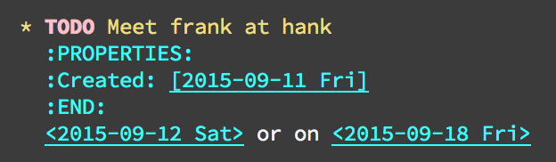
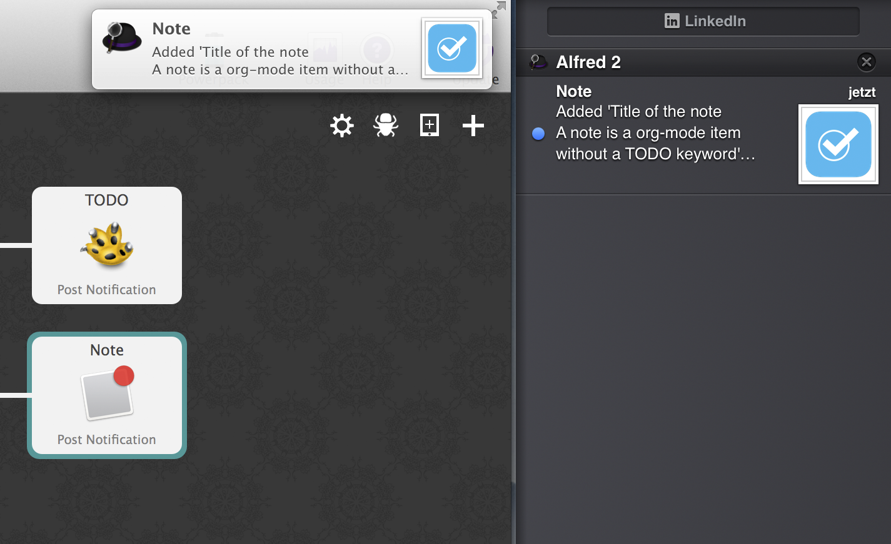

# An org-mode-capture workflow for Alfred
Append a todo or a note to an org-mode file with a short and convenient command in [Alfred](https://www.alfredapp.com/). The workflow requires Alfred's "Powerpack."

## Features
The command appends a second level heading to a user defined .org file and puts all what follows `:: ` into the body of the heading (see figures below).

Type todo to add a todo:






Type note to add a note:






The added notes and todos are divided into title and content:




Relative dates (Monday, tuesday, tomorrow, morgen, freitag) in the content part of the entry are converted into orgmode specific date formats `<2015-09-11 Fri>`.






If enabled, then date of creation is added to a property car:




## Installation
Double klick on `org-mode-capture.alfredworkflow` to add it to Alfred's set of workflows. Then you need to set the path to your existing org-mode inbox file in both python script nodes (absolute notation of the path is necessary). You can also change the delimiter pattern to distinguish between head and body elements and disable the relative date replacement by setting it to `False`:

```python
org.inbox_file = '/Users/Alex/Documents/Planung/Planning/Inbox.org'
org.delimiter = ':: '
org.add_creation_date = True
org.replace_relative_dates = True
```


## Supported modes of notification

If you don't use growl, you can change the notification nodes in the alfred workflows to apple's notification centre:


